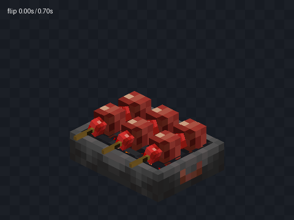

# Kaleidoscope Grilling — unofficial Bedrock port

煙火（Grilling）的非官方 Minecraft 基岩版移植工程。

**目前：A1.14累積素材＋A1.15沉浸式動效驗收台。不是完整生存玩法。**

唯一寫入目的地：`casama233/kaleidoscope-grilling-unofficial`，repository ID **1377218440**。

## A1.15：從刷油，到最後一口

新增獨立BP/RP驗收台，空手互動連續查看：點火、上三串、1秒刷油、四次0.7秒拋起翻面、0.5秒倒瓶撒料、取串、四口進食展示。使用原作貼圖與OGG；聲音隨空爐、取消和實體移除停止，不每tick重疊播放。

- **[下載動效驗收包 `.mcaddon`](artifacts/Grilling_Immersion_Lab_A1.15.mcaddon)**
- **[A1.15實際進度、操作方式與還原邊界](docs/STATUS-A1.15.md)**
- **[獨立bridge.動效工程](projects/grilling/integration/immersion_lab/)**
- **[逐幀／慢放／原音效檢查頁](projects/grilling/reports/immersion_a115/index.html)**：自包含HTML，保存後用瀏覽器開啟。
- **[真正的建置、事件測試與官方Dash編譯記錄](https://github.com/casama233/kaleidoscope-grilling-unofficial/actions/runs/35455778472)**



**工具位置與浮空分口樣本是驗收配置，不是已完成的玩家手部。** 原作六組進食規則、第一／第三人稱和雙手動作來源另附；原生骨骼與相機綁定仍待完成。沒有覆蓋player.json、沒有另加指南書、沒有改動Cookery，也沒有材料消耗或飢餓回復。

本批實際結果：30項流程／公式測試、16項真實適配器＋模擬事件宿主測試通過；60個翻面姿態×兩個角度共120對圖像一致。新展示BP/RP由Windows上的官方Dash v1.2.0編譯成功，RP28、BP12份檔案逐一對照實際輸出。1644份既有基線檔案保持不變。

資料與限制见`projects/grilling/reports/immersion_a115/`。**Dash、模擬宿主和離線光柵器都不能替代Minecraft／BDS實機驗收。**

## A1.14累積素材基線

| 內容 | 已驗證範圍 |
|---|---|
| 累積素材 | 381份Bedrock `.geo.json`、381份對應 `.bbmodel`、171張圖集；不是762種食物 |
| 植物 | 魚腥草11個外觀＋花椒樹苗／原木／兩種樹葉 |
| 來源 | 669份來源記錄；烤爐保留fork來源，Minecraft模板另列權利歸屬 |
| 原有素材保護 | A1.12的888份模型／編輯檔／圖集和628份來源保持SHA-256不變 |
| 靜態幾何審查 | 全部381候選有向表面與UV一致；植物新增120對八角度圖片一致 |
| bridge.編譯 | 官方Dash v1.2.0實際編譯主RP及指南BP/RP並核對輸出 |
| 玩家筆記核心 | 27項模擬玩家儲存測試通過；尚未接入原指南動態操作頁面 |

歷史範圍、植物透明面修正與限制見 **[A1.14實際進度](docs/STATUS-A1.14.md)**。本批新增的一個動作展示場景不計入381種靜態候選。

## 工程位置

- **[主素材工程](projects/grilling/)**：在bridge.開啟此資料夾，不是倉庫根目錄。
- **[獨立指南章節測試工程](projects/grilling/integration/cookery106/)**：我方BP/RP，不含Cookery原包。
- **[可編輯模型](projects/grilling/editor/generated/)**、**[Bedrock幾何](projects/grilling/resource_pack/models/entity/kg_a1/)**、**[貼圖圖集](projects/grilling/resource_pack/textures/kg_a1/)**。
- **[玩家筆記核心](notebook/)**：搜尋、收藏、有順序的自訂配方及玩家儲存適配器。
- **[動效建置與測試來源](development/immersion/)**：與原有靜態素材建置器分開。

## 植物離線預覽

這些圖片由實際匯出幾何渲染，不是Minecraft截圖。樹葉未套用生態域染色；樹木世界生成尚未完成。

[魚腥草八階段](projects/grilling/reports/plants/houttuynia-ages.png) · [後期紅色變體](projects/grilling/reports/plants/houttuynia-red-variants.png) · [花椒部件](projects/grilling/reports/plants/pepper-parts.png)

## 可重跑的檢查

```sh
node notebook/test.mjs
node development/immersion/test.mjs
node --experimental-vm-modules development/immersion/test_runtime.mjs
python -m pip install numpy==2.3.5 Pillow==12.3.0
python projects/grilling/tools/build_assets.py
python development/immersion/verify.py
```

重建動效需要固定上游提交的本地快照：

```sh
python development/immersion/build.py --upstream /path/to/KaleidoscopeGrilling-9a1acdab27698457bec16c9362678e574895a28c
```

安裝bridge.官方Dash後，在要編譯的工程目錄執行 `dash_compiler build`（Windows独立程式可用 `dash.exe build`）。動效工程編譯後，可在倉庫根目錄執行 `python development/immersion/verify.py --compiled` 比較輸出。

先前成功流程：

- [A1.12素材重建及集合雜湊核對](https://github.com/casama233/kaleidoscope-grilling-unofficial/actions/runs/35451900945)
- [植物幾何及120對八角度比較](https://github.com/casama233/kaleidoscope-grilling-unofficial/actions/runs/35452356584)
- [主RP＋指南BP/RP的真實Dash編譯](https://github.com/casama233/kaleidoscope-grilling-unofficial/actions/runs/35452461036)
- [筆記資料核心測試](https://github.com/casama233/kaleidoscope-grilling-unofficial/actions/runs/35450471711)

`migration/bootstrap.py`與`development/run_plants.py`是一次性搬遷工具，不應在既有工程上重複執行。日常主素材重建使用`tools/build_assets.py`；動效建置器只重建獨立驗收台，不覆蓋主RP或原指南。

## 尚未完成

原生玩家主副手／第一第三人稱的精確綁定、接觸動效、餐盤與擺放、自由組合串、真實流體與粒子效果、指南動態搜尋／收藏／自訂配方頁面、完整玩法與多人驗收。魚腥草与花椒只有靜態素材，沒有種植、採收或樹木生成。

**Dash成功不等於bridge.圖形介面、Minecraft、BDS或材質／光照／動畫已驗收。** 來源與匯出解析分開，但離線圖像比較共用光柵器；新展示台只在標準20TPS下對齊主要時序，低TPS與Java牆鐘差異仍需處理。

## 來源、授權與資料保護

原作素材保留CC BY-NC-SA 4.0條件，原碼與衍生工具的BSD聲明與素材分開，Minecraft模板不套用CC聲明。主工程`source_manifest.json`、`ATTRIBUTION.md`與獨立驗收台`sources/manifest.json`保留出處，輸出BP/RP包含授權與致謝。

不提交使用者完整Cookery安裝包、私人宿主腳本、世界、憑證或機器資料。森羅物語指南維持一個煙火入口，不另發書物品。此前完整歷史HTML與全部舊比對圖未全數入庫；原交付附件保留原歷史範圍。
