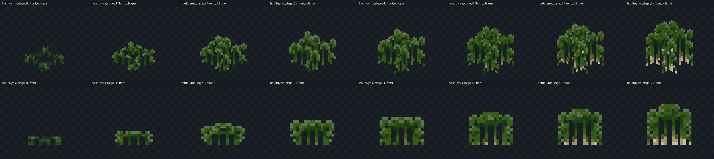
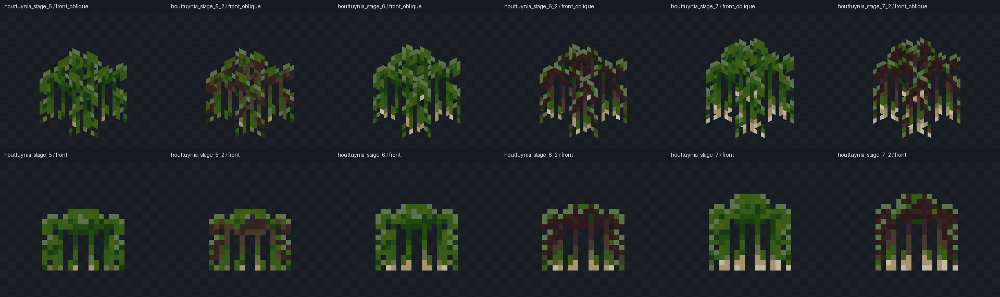
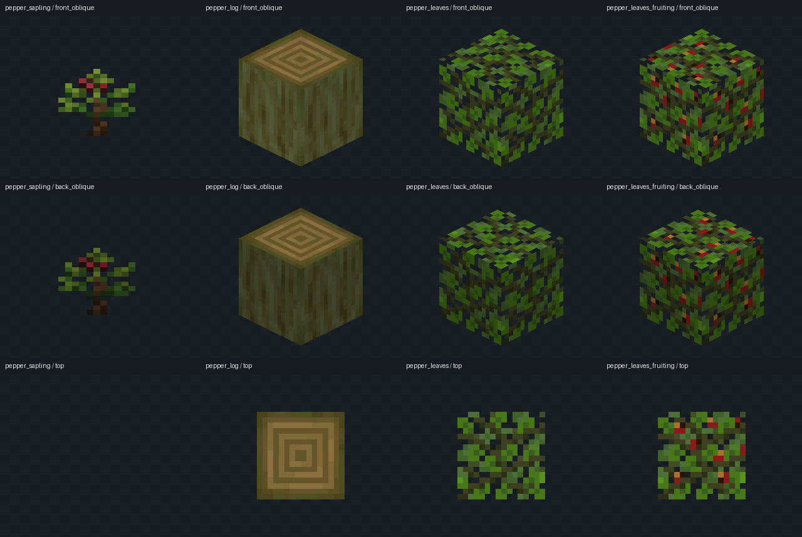

# Kaleidoscope Grilling — unofficial Bedrock port

煙火（Grilling）的非官方 Minecraft 基岩版移植工程。

**目前：A1.14.0 靜態素材工程。不是完整可遊玩的附加包。**

唯一正確目的地：`casama233/kaleidoscope-grilling-unofficial`，repository ID **1377218440**。

## 已完成並實際入庫

| 內容 | 已驗證範圍 |
|---|---|
| 累積素材 | 381份Bedrock `.geo.json`、381份對應 `.bbmodel`、171張圖集；不是762種食物 |
| 本輪植物 | 魚腥草11個外觀＋花椒樹苗／原木／兩種樹葉，共15個新候選 |
| 來源 | 669份来源記錄；烤爐仍標記為fork來源，Minecraft模板另列權利歸屬 |
| 原有素材保護 | A1.12的888份模型／編輯檔／圖集和628份來源保持SHA-256不變 |
| 幾何審查 | 全部381候選有向表面與UV一致；新增120對八角度圖片一致 |
| bridge.編譯 | 官方Dash v1.2.0已在Windows Actions實際編譯主RP及指南BP/RP，並核對輸出 |
| 玩家筆記核心 | 27項模擬玩家儲存測試通過；尚未接入原指南動態操作頁面 |

詳細範圍、第一次透明面比較失敗與修正、限制及剩餘工作見 **[A1.14實際進度](docs/STATUS-A1.14.md)**。

## 工程位置

- **[主素材工程](projects/grilling/)**：在bridge.開啟此資料夾，不是倉庫根目錄。
- **[獨立指南章節測試工程](projects/grilling/integration/cookery106/)**：我方BP/RP，不含Cookery原包。
- **[可編輯模型](projects/grilling/editor/generated/)**、**[Bedrock幾何](projects/grilling/resource_pack/models/entity/kg_a1/)**、**[貼圖圖集](projects/grilling/resource_pack/textures/kg_a1/)**。
- **[玩家筆記核心](notebook/)**：搜尋、收藏、有順序的自訂配方及玩家儲存適配器。

## 本輪離線模型預覽

這些圖片由實際匯出幾何渲染，不是Minecraft截圖。樹葉是未套用生態域染色的來源參考；樹木世界生成尚未完成。







## 可重跑的檢查

```sh
node notebook/test.mjs
python -m pip install numpy==2.3.5 Pillow==12.3.0
python projects/grilling/tools/build_assets.py
```

安裝bridge.官方Dash後，分別在主工程及指南工程目錄執行 `dash_compiler build`（Windows獨立程式可用 `dash.exe build`）。編譯輸出不會直接寫入Minecraft世界。

已成功執行的遠端驗收：

- [A1.12素材重建及集合雜湊核對](https://github.com/casama233/kaleidoscope-grilling-unofficial/actions/runs/35451900945)
- [植物幾何及120對八角度比較](https://github.com/casama233/kaleidoscope-grilling-unofficial/actions/runs/35452356584)
- [真正的bridge. Dash主RP＋指南BP/RP編譯](https://github.com/casama233/kaleidoscope-grilling-unofficial/actions/runs/35452461036)
- [筆記資料核心測試](https://github.com/casama233/kaleidoscope-grilling-unofficial/actions/runs/35450471711)

`migration/bootstrap.py`與`development/run_plants.py`是**一次性搬遷工具**，完成後不應在現有工程上重複執行；它們會拒絕覆盖已存在的目標。日常重建使用主工程`tools/build_assets.py`。

## 尚未完成

餐盤與擺放、自由組合串、流體／粒子、手持／副手／掉落姿態及動作、指南動態搜尋／收藏／自訂配方頁面、完整玩法與多人驗收。魚腥草與花椒只有靜態素材，沒有種植、採收或樹木生成。

**Dash成功不等於bridge.圖形介面、Minecraft、BDS或材質／光照／動畫已驗收。** 來源與匯出模型解析獨立，但八角度比較共用離線光柵器。

## 來源、授權與資料保護

原作素材保留來源及CC BY-NC-SA 4.0條件；工具與素材授權分開，Minecraft參考模板不套用CC聲明。詳見主工程的`source_manifest.json`、`ATTRIBUTION.md`與相應LICENSE。

不提交使用者的完整Cookery安裝包、第三方私有腳本、世界、憑證或機器資料。不修改原指南，保持原森羅物語指南內只有一個煙火入口，不另新增指南書。

此前完整歷史HTML、數千張歷史PNG及全部歷史輔助工具未在本輪全數入庫；原交付附件保留其歷史範圍。[初始搬遷檢查點](docs/MIGRATION_STATUS.md)記錄的是首批筆記入庫，不代表現在仍只有筆記。
