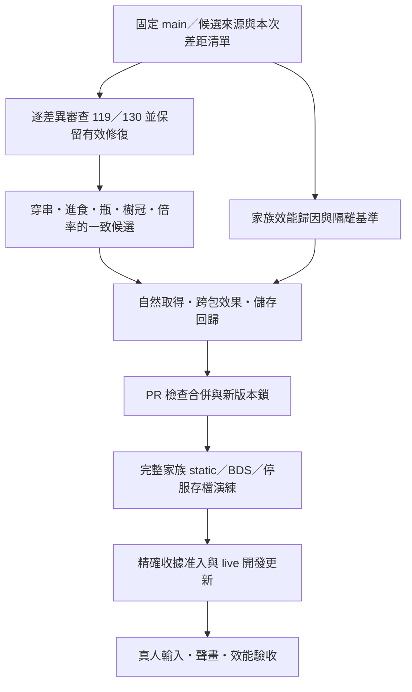

# 煙火 Java／Bedrock 功能與體驗審查（2026-10-05）

本報告評估 canonical **2.8.61／81df62d2574c23175a8027fdcfdf1d3eec0a315b**，不是把所有分支加在一起的理想版本。核心烹飪流程已有大量實作；目前不足以宣稱完整還原 Java 的互動、聲畫、自然取得及多人效能。**有物品、有模型、有通過測試，均不等於玩家可以完成相同體驗。**

這是功能面、來源與驗證範圍審查，沒有重新執行每個 Java 方法、全部用戶端畫面或完整生存遊玩。私有存檔、錄影、機器日誌及 live 效能分析另存使用者本機，不在此公開。

## 1. 比較基準與證據規則

- [CurseForge 原作說明](https://www.curseforge.com/minecraft/mc-mods/kaleidoscope-grilling)列出的正式主檔為 NeoForge 1.21.1／1.1.1，並提供 Forge 1.20.1 分支。以正式玩法、實際 Java 原始碼及發布資料共同定義需求。
- 本次重新取得[作者來源 9a1acdab27698457bec16c9362678e574895a28c](https://github.com/breezeth-CN/KaleidoscopeGrilling/tree/9a1acdab27698457bec16c9362678e574895a28c)，遠端 main／HEAD 均指向該提交。README 寫 1.1.1a，但兩平台 Gradle 版本仍為 1.1.1；不將 README 名稱視為另一個已驗證發布包。主要程式比較使用 NeoForge 1.21.1；Forge 專有差異未逐項重跑。
- 現有原包 bytecode／資產 fixture 是歷史證據；本次沒有重新啟動 Java 客戶端。來源 pin、來源測試、BDS 引擎、保存／重載和真人呈現分別記錄。
- [來源收據與工作項目](evidence/java-parity-audit-20261005.json)固定本次檢查的 commit、檔案 hash、候選來源與驗收條件。來源檢查已通過；`compiled=false`，不冒充本次重新編譯或真人驗收。
- 不提供「完成百分比」：目前不存在覆蓋全部玩法與設備的共同驗收分母。

## 2. 版本混亂已定位

| 層級 | 審查時的狀態 | 可採用的結論 |
| --- | --- | --- |
| canonical main | 2.8.61，`81df62d` | 本報告的當前實作基線 |
| [PR #119](https://github.com/casama233/kaleidoscope-grilling-unofficial/pull/119) | draft，`4ee97f0`，分支也自稱 2.8.60 | 包含另一套進食／樹冠修復；不能用版號判斷與 main 2.8.60 相同 |
| [PR #130](https://github.com/casama233/kaleidoscope-grilling-unofficial/pull/130) | draft，2.8.66，`83797b7` | 基於公開 2.8.61 的測試候選；尚未合併、不能計入當前交付 |
| 舊總表 | `CURRENT-REPAIR-STATUS.md` 追蹤至 2.8.51 | 保留歷史，停止將其作為目前完整清單 |

#130 相對 main 涉及 **565 個檔案**，不是單一秘製串修正。其文件記錄有限範圍的原生穿串、烹飪、主副手圖像與 500ms 取消；也明列底部食材裁切、第三人稱、ALT、完整／連續進食及存檔重載等未閉合條件。這些是**該候選的既有紀錄**，不是本輪重新觀察，也不能外推至所有設備或 main。

整合方式：按「來源提交＋功能差異＋證據範圍」保存有效工作。不得回退 main、直接安裝 #119 或把 #130 全部內容當已完成驗收；不得重用已凍結版號。

## 3. 完整功能面矩陣

表中「有實作」只表示來源可追蹤；「部分」包括平台替代與未閉合流程；「候選」表示尚未進入比較基線。

| 功能面 | 2.8.61 實作與 Java 差距 | 玩家影響／驗收重點 |
| --- | --- | --- |
| 固定串目錄 | 19 組 raw→cooked，加獨立 ordinary 串；麵筋、羊肉、黃金串均存在 | 不能因舊表寫 19 就報少一種。逐串核對材料順序、營養、效果、動畫，不用 JSON 數量當完成度 |
| 手工穿串／拆串 | 主副手材料、最多三份、固定配方與秘製 snapshot 已有；蹲下輸入路由在 #130 仍有調整 | 空串起步、點空氣／方塊／實體、連按、蹲下、滿背包和拆解全返還須同一候選驗證 |
| 秘製營養 | 已有烹熟映射、重複食材係數與生食折扣；第三方食材依登記表／API | 任意 Java `finishUsingItem` 回呼不能由有限效果表普遍取代；未知食品不能宣稱全部繼承 |
| 秘製外觀 | 手持 catalog、三食材 properties 與設備投影已有；main 控制器直接讀 attachable `q.property`，#130 加入 owning-player 讀取修復 | 視覺缺陷有候選修復，未在 main 交付。任意食材 tint、16×16 背包合成圖示與新模組模型仍不完整 |
| 烤爐狀態機 | 三槽、四翻、20 tick 冷卻、800／400 tick 過熟階段均有來源對應 | 不應重做整套烤爐；優先測多人同槽、油／調料扣料、拆爐、爆炸、斷線與重載 |
| 食材加工 | 刀取食材、砧板、磨粉、油餅及炒燉配方已有；部分依已登記 Cookery 擴充 | 普通作者原包與完整家族並非同一能力；需以正常取得串起全流程，不能只用 give 測試 |
| 榨油器／大缸 | 四餅、16 進度、石頭／鐵砧不同增量、出油與油渣已有 | 敲擊冷卻、容器滿／缺缸、斷點重載與出料不重複；落錘方向與聲畫需真人 |
| 油壺／三油 | 油型、容量交易、主副手擴充及 1200／12000／24000 ticks 熱期限已有 | 作者 legacy 壺與新型壺不能混為同一容量。跨包 metadata、空壺與耗盡身份須保留 |
| 世界油流 | 腳本方塊流動；有來源／格數預算；熔岩辣椒油有發光 | 不是 Java FluidType；原作環境熔岩／火焰粒子未完整接上。流動、碰撞、桶、區塊邊界要獨立比較 |
| 調料配方 | 八份、三基底、16 使用次數、4 秒搖勻、分層資料及頂瓶操作已有 | 放置／堆疊／拿回／搖勻／撒料須同一身份連貫；不能用靜態彩色瓶代表操作已完成 |
| 調料呈現 | 2.8.61 修了 palette UV 與 native 材質；#130 又包含手持／撒料與實體瓶變更 | 材質載入修復不能代替第一／第三人稱、兩手、四瓶、八層及動作停止驗收 |
| 熱度與合併 | 加權合併與到期結算已有；Bedrock 保留逐 tick 期限，Java `FoodState` 有 100 tick bucket | 這是可辨識差異，不默默撤回舊修復。背包／容器徽標、關閉容器中的顯示與手勢仍有差距 |
| 熱食倍率 | 公開設定存在，但 main `addSecretNutrition`／其盤子路徑仍寫死 1.25 | 非預設倍率時，同樣熱食可能因食用途徑取得不同飽和度；#130 有對應修正 |
| 進食門檻／結算 | 有 25 tick 提早放開、90／100 tick 原生 profile、扣料與事件身份校验 | source gate 不證明實際完成事件順序。24／25／26 tick、完整吃完、連續兩串、切槽／斷線要分測 |
| 進食聲畫 | 五類動畫、原作音檔、圖形條與兩手資料已有；精確原作手臂／第二截模型未閉合 | 第一／第三人稱、不同 FOV、皮膚、走動／蹲下與旁觀者；持有副手物品不等於原生副手進食可用 |
| 效果語義 | 原生效果與自訂效果、奶／重生清理已有 | Java 狀態效果回呼與 Bedrock 輪詢代理有差異；效果續期、升級、奶／死亡／登入必須驗證 |
| 龍血／重金屬 | 原生 20／26／30 最大生命及 10 分鐘中毒冷卻已有 | Java 重金屬在死亡事件攔截，移植在受傷前比較傷害／生命；護甲、吸收、連擊與其他包回呼的等價性未證明 |
| 麻木／特殊串氣氛 | 麻木有動畫代理；黃金／無敵／盾成功分支有補充粒子聲音 | 原作準星變形不是玩家骨架動畫；普通串致死分支的完整粒子仍有缺口 |
| 串盤 | 五串、取最後一串、選最高營養串、metadata 與交易已有 | 拆放、食用、滿背包／掉落、作者署名／熱度保存；盤上畫面需與真正內容一致 |
| 串譜／牆上食譜 | 固定與秘製記錄、材料消耗、牆上互動已有 | 身份變體／庫存不足／取消不扣物；牆面命中和主副手手勢需真人 |
| 高級廚具架 | 5＋4 槽、實物點取、表單、交換／歸還與借還 API 已有 | Java CapsLock 按住／放開快捷介面未等價；觸控／手把替代必須實際減少步驟，不能只加一個表單 |
| 油菜／洋蔥／紅薯／折耳根種植 | 齡段、收成、骨粉、紅色變種及支援土壤已有 | 草帽草叢取得、採收數量、農田／靈魂沙和生存加工鏈需逐項驗證 |
| 花椒樹 | main 自然生成仍為舊 tree_feature；與 #119 修復前檔案 SHA256 相同 | #119 記錄舊特徵生成無葉樹；#130 帶 seed＋樹冠修復。候選未交付，自然採集與景觀仍列高優先 |
| 花椒葉碰撞 | 傷害／接觸邏輯有實作 | Java `entityInside` 黏滯與條件碰撞不等於單純踩踏；穿越樹冠、站頂、普通生物需對照 |
| 要塞折耳根 | Java 25% 座標規則與 fresh-generation API 已有 | runtime 明示 `vanillaFortressCallbackInstalled:false`；API 存在不是原生新要塞會自然替換。箱中取得與自然植株須分開 |
| 指南／多語 | 既有 Cookery 單一入口、六類烹飪分類、三語投影已有 | 正常生存可達、逐項材料和取得狀態；不另造實體指南，不用酒館七類覆寫煙火六類 |
| 設定 | 飽和度、滿飢餓、HUD、可選熔爐熱食及展示預算可設 | Java 關動畫→25 tick 原版食用、Cookery 熱／調料總開關未完整對應；關圖形條不是關動畫 |
| 自動化／選用整合 | Bedrock 有公開 food/oil/stack/rack 等 API | Create 動力加工、女僕 AI、KubeJS、JEI／Jade 不能因存在接口就算移植；需列成獨立選配能力 |
| 儲存／相容 | own DP、原生容器、交易回復與家族鎖已有；部分容器有實驗功能前提 | 新世界載入不能代表老存檔、玩家物品與 UUID 遷移；helper 只是顯示，不能成為第二份可領物品 |
| 效能／規模 | 展示有區域索引、去重及預算；仍有逐玩家 tick、逐活躍烤爐 tick、油流與 helper 成本 | 未提供同場景 Java／Bedrock 長時負載、真人 FPS 與操作延遲比較，不能宣稱流暢或性能等價 |

本輪直接對照作者 `grilling/skewers.json` 與 runtime 資料：**19 組 raw→cooked 輸出全部一致，18 筆有明示效果的 ID／時長全部一致**。Bedrock 組串表另含 ordinary，合計 20 筆。這只驗證資料表，不驗證任意第三方 tag、原生食用或效果呈現。熱食倍率的純數值重現則顯示：基礎飽和增益為 4 時，設定 1.0／1.25／2.0 都在該路徑得到 5，應分別為 4／5／8（未計上限）。

## 4. 可立即重現／追蹤的問題

| ID | 優先 | 證據與定位 | 關閉條件 |
| --- | --- | --- | --- |
| G01 | P0 | 舊總表、main 和兩個 draft 的身份／完成狀態混用 | 本表與 JSON 成為此次入口；每次只按 exact commit／receipt 更新，不複製舊「通過」 |
| G02 | P1 | `features/pepper_tree_worldgen.json` 舊特徵 hash 與 #119 修復前一致 | 在乾淨候選新區塊原生生成驗證樹冠／果葉，跨區塊卸載恢復；不重建玩家木構 |
| G03 | P1 | `render_controllers/secret_held.render_controllers.json` 讀取屬性上下文；#130 有修復 | 兩手三食材、THREE／ALT、熟前熟後、第一／第三人稱及取消／重載可見；metadata 不變 |
| G04 | P1 | `main.js:addSecretNutrition` 固定乘 1.25；`addNestedNutrition` 共用 | 1.0／1.25／2.0 下手持提早／完整食用與盤子食用一致；不超飽和上限、不重複營養 |
| G05 | P1 | `integration_api_runtime.js` 明示原生要塞 callback 未安裝 | 真正新生成來源驅動替換並保留玩家種植；做不到則保留缺口，不以附近扫描冒充 |
| G06 | P1 | `main.js` 食用時間／事件與 `player_presentation_core.js` 同步範圍不足；#130 待完整吃法驗證 | 門檻／完成／連續／切槽／斷線／兩手全部一致，原生事件與客戶端錄影對齊 |
| G07 | P1 | 調料瓶由 .56→.61 多次修復；#130 還有新方案 | 原作放取、分層、搖勻、撒料十 tick、消耗／耗尽，雙人觀看與三輸入方式閉合 |
| G08 | P1 | 重金屬死亡攔截與受傷前代理不同；龍血共享 player 定義 | 最終傷害／護甲／吸收／同 tick 連擊、奶／重生／重登入，以及其他包效果不受破壞 |
| G09 | P2 | `server_config_core.js` 未覆蓋 Java 關動畫／Cookery 開關 | 設定、實際路由、指南與持久值一致；重啟保留，動畫關閉仍 25 tick |
| G10 | P2 | `a23_oil_world.js` 腳本油流與環境粒子缺口 | 不混油、不失桶、不重複出油；邊界與滿缸回復；補來源相符的節流粒子 |
| G11 | P2 | 背包動態圖標、熱食徽標、麻木準星、快捷架鍵盤模式不等價 | 逐項記為原作一致／明示平台替代／未完成，使用可操作的真人案例驗收 |
| G12 | P1 | 原生保存、跨包公開資料、盤架交易的完整玩家回歸仍不足 | 隔離存檔重載前後逐物品身份／份數／熱度／調料／食材一致，失敗可回退 |
| G13 | P0 | 家族效能須獨立觀測；有界 helper 並不是性能證明 | 用相同場景比較最小依赖與完整家族，分離來源成本；不得把未量測值填成通過 |
| G14 | P2 | 第三方 food callbacks／Create／Maid 等未完整移植 | 按能力與作者契約逐一實作和驗證，選配未完成不隱藏、也不阻塞基本烹飪修復 |

## 5. 效能預算的實際含義

`server_config_core.js` 預設 contents helpers 2048、fixed grill helpers 1024、placed helpers 1024。這是三種展示上限，**不是 4096 台設備的保證容量**。秘製串一串可佔三個食材 helper：單盤五串即最多 15 個；同一可見區域 137 個滿盤需求 2055，已超出 contents 預算。這是依程式計算的上限案例，並非 FPS 基準測試；架子與其他展示還共享該池。

contents 每 tick 取 8 個 target，48 格可視範圍；dirty／urgent／cleanup 共用預算。不能據此承諾每個設備即時刷新。油流每次取最多 8 個 source，每 source 最多 512 格；4096 是理論格級工作額度，不是毫秒。活躍烤爐 `phaseTicks` 每 tick 改變並寫 DP；玩家每 tick 也執行手持／效果同步。它們是 profiler 優先定位點，尚不能單靠程式閱讀斷言誰造成卡頓。

工作站內容變更、咀嚼音、粒子、世界存儲與客戶端 entity 渲染要分別量測。單純調低展示數量會造成「盤裡有食物但看不見」，不能算無代價性能修復。

## 6. 已展開的修復順序

1. **來源與追蹤修復（本次）**：確認 main／遠端／乾淨工作區，保存候選邊界；建立 G01–G14 與退出條件；舊總表改為歷史入口。僅文件改動，runtime 不換版、不重啟。
2. **性能與候選整合（第一批）**：先建立最小家族／完整家族同場景測試，逐一定位持續性慢速；對 #130 做功能單元與來源歷史審查，吸收 G02／G03／G04／G06／G07 有效部分，保留 .61 材質修復。不得直接把 565 檔視為一個已驗收補丁。
3. **生存與持久化（第二批）**：串起採集→加工→榨油→調料→烤食→盤／架→重登入；處理 G05／G08／G12。自然要塞 callback 不能完成時，明列平台缺口及真正可取得途徑。
4. **沉浸完善（第三批）**：設定等價、聲源與停止、原作粒子、圖示、快捷架跨設備操作；逐場景確認原作一致或明示替代。保留安靜 HUD，不加入自創 actionbar 成功提示。
5. **選配整合（獨立批）**：第三方食品與自動化按正式 API 實作，不假裝 Java 模組原封移植，也不以此拖延基本玩法交付。

每個功能批均在 canonical Git 實作、採用全新未佔用 release identity，同步 BP／RP／module／guide／payload／dependencies／hash／history。完整家族三項預檢通過後按既有持續授權部署 live；逐候選登記精確 receipt SHA256，保留回退及 `client=false`、`production_ready=false`、`pending_client_acceptance`，直到真人實測完成。

## 7. 驗收設計

| 組別 | 必測組合 | 通過依據 |
| --- | --- | --- |
| 生存流程 | 所有 19 raw 配方＋ordinary；獨特／重複／不可食秘製；三油；三基底及附加調料 | 正常取得、完整加工、實際扣料／產出／營養，無 give 代替取得鏈 |
| 吃法 | 24／25／26 tick；90／100 tick 完成；連吃；500ms 取消；切槽；主副手；飢餓／滿飢餓 | 消耗一次或不消耗、聲畫停止、原生事件與權威資料一致；無模擬玩家 |
| 瓶／盤／架／爐 | 1／3 槽爐、1／4 瓶、0／8 層、0／5 串盤、九槽架、四朝向 | 所見等於所有權資料；無重複領物、幽靈物品或永久空展示 |
| 生命週期 | 正常重啟、卸載區塊、重登入、死亡、奶、拆除、爆炸、容器滿、交易失敗 | 食材／效果／時限／身份守恆；失敗可恢復且不隱瞞 |
| 客戶端 | 鍵鼠／觸控／手把；第一／第三人稱；FOV 60／90／110；標準／細手臂；兩名真人互看 | 同候選錄影、input 與內容警告記錄；未知設備保留未驗收 |
| 規模 | 1／16／64 爐；1／32／128 盤架；1／8／32 油源；單人／4／8 真玩家 | 最小依賴與完整家族對照；分開冷啟動、熱身、30 分鐘穩態與 2 小時存儲／記憶體 |

效能擬定門檻：穩態無 Watchdog slowdown／high-memory／終止；操作視覺 p95 ≤200ms；同設備同場景 FPS 中位與低幀相對修復前不退步超過 10%；暖機後不得持續累積孤兒 helper／未完成交易。它們是**待量測的工程目標**，不是目前成績。若沒有原生 tick profiler，不把排程延遲稱為 MSPT；不從 CPU% 推算 TPS。

## 8. 主要原作與 runtime 定位

- 原作：[GrillBlockEntity](https://github.com/breezeth-CN/KaleidoscopeGrilling/blob/9a1acdab27698457bec16c9362678e574895a28c/neoforge-1.21.1/src/main/java/cn/breezeth/kaleidoscope_grilling/grill/GrillBlockEntity.java)、[MultiBiteSkewerItem](https://github.com/breezeth-CN/KaleidoscopeGrilling/blob/9a1acdab27698457bec16c9362678e574895a28c/neoforge-1.21.1/src/main/java/cn/breezeth/kaleidoscope_grilling/skewer/MultiBiteSkewerItem.java)、[SecretSkewerItem](https://github.com/breezeth-CN/KaleidoscopeGrilling/blob/9a1acdab27698457bec16c9362678e574895a28c/neoforge-1.21.1/src/main/java/cn/breezeth/kaleidoscope_grilling/skewer/SecretSkewerItem.java)。
- 原作：[HotFoodConfig](https://github.com/breezeth-CN/KaleidoscopeGrilling/blob/9a1acdab27698457bec16c9362678e574895a28c/neoforge-1.21.1/src/main/java/cn/breezeth/kaleidoscope_grilling/food/HotFoodConfig.java)、[FoodState](https://github.com/breezeth-CN/KaleidoscopeGrilling/blob/9a1acdab27698457bec16c9362678e574895a28c/neoforge-1.21.1/src/main/java/cn/breezeth/kaleidoscope_grilling/food/FoodState.java)、[AdvancedSeasoningHandler](https://github.com/breezeth-CN/KaleidoscopeGrilling/blob/9a1acdab27698457bec16c9362678e574895a28c/neoforge-1.21.1/src/main/java/cn/breezeth/kaleidoscope_grilling/seasoning/AdvancedSeasoningHandler.java)。
- runtime：[主互動與進食](../projects/grilling/gameplay_core/behavior_pack/scripts/main.js)、[烤爐核心](../projects/grilling/gameplay_core/behavior_pack/scripts/core_logic.js)、[整合能力](../projects/grilling/gameplay_core/behavior_pack/scripts/integration_api_runtime.js)、[設定](../projects/grilling/gameplay_core/behavior_pack/scripts/server_config_core.js)、[設備展示](../projects/grilling/gameplay_core/behavior_pack/scripts/station_contents_visual_runtime.js)。
- 維護：[基線規則](BASELINE-MAINTENANCE.md)、[過往審查](PARITY-AUDIT-20261003.md)、[2.8.61 材質修復](RELEASE-NOTES-2.8.61.md)。歷史證據保留原版身份，不提升為當前候選已驗收。
