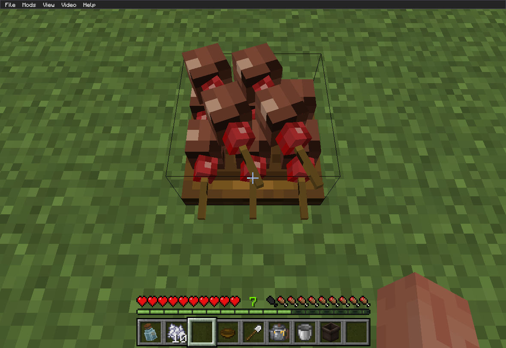

# G88 bounded native plate result

Observed on 2026-10-07 UTC using Bedrock 1.26.52.3 x86_64 and exact runtime source `7e0d855fcd9a5e5e9a1ed71f27f25137c4334543`, full Git tree `d54cf80df87f3c4884f443e93ba1f4ea2d2a823f`. Installed review archive SHA256: `36c55148a570a18beb8536aebaf8e7f466592de5ebabef256da517ecdc614941` (14,032,028 bytes). Its source/archive receipt, installed clone and real [canonical CI archive](https://github.com/casama233/kaleidoscope-grilling-unofficial/actions/runs/37575697486) were checked independently. Documentation added afterward does not change those runtime bytes.

## Observed passes

- The same preserved custom occupied plate that formerly failed completed an ordinary 1800 ms use. The selected item became a bowl, hunger increased from 10 to 13, regeneration/absorption icons and two golden hearts were visible
- An upright 100 ms interaction with a canonical stack of two inserted one skewer, changing the plate from one to two, and immediately left one held item. A delayed server quantity query after 25 seconds still confirmed that item; hunger remained 13
- A separate upright 4700 ms interaction with a fresh stack of two changed the plate from two to three and left one held item. A delayed server query after 32 seconds still confirmed it; hunger remained 18
- Turning aim away from the plate and using the held remainder in air for 4700 ms consumed it normally: hunger increased from 13 to 18 and a Strength icon appeared. An earlier 1800 ms ordinary-skewer attempt did not consume it; these observations do not establish timing parity
- Forward counts 1→2→3→4→5, reverse 5→4→3, and return 3→4→5 visibly retained food and shafts. The lower slot was straight immediately after 3→4; the raised diagonal changed on 4→5
- At the same explicit camera, the full five-skewer geometry visibly matched before and after save/reload. The old lower-right stale angle was absent

No opt-in diagnostic tag was enabled. These are direct G88 observations, rather than inherited acceptance from an earlier version.

## Same-camera reload evidence

Before save/reload:

After save/reload:

The screenshots are unchanged captures. Plate geometry visibly matches; JPEG bytes and surrounding scene pixels are not expected to be identical. Screenshot SHA256:

- Before: `81a888dab12651340cc4173f64016105b27207b94ac14696861fa974fe712045`
- After: `f0801e9caf75f36003db73416826636f80459cc3867b4a2cc5c6d9d5dbc027ca`

Other bounded observation capture digests:

- Custom plate consumption: `1e32122f0b95b6a49b48ebe766c311fcca5f3d72271f177129d620f5281b2584`
- Short upright delayed remainder: `53d614fb3481c50d7f85861ed954936492a7f44d525fa0ccf93a07c130fc0209`
- Long upright delayed remainder: `4e10a44007a91e26125d5694053703d4b6243738a5b64fe42eaca466f3f9a4ac`
- Air eating completion: `500c286678a8b60a643983530288afca669ced5687490c626726188082a631c1`

## Limits and remaining gates

This closes the two reproduced G86 defects for the bounded inputs above: unintended later consumption after a plate interaction and stale rendered yaw across these count transitions/reload. It also reconfirms the preserved custom-plate nutrition path.

It does not certify every facing, item family, animation, timing, perspective or pixel-perfect Java comparison. Audio was unavailable in the native environment. Full-family, saved-world/live admission, BSM upstream freshness and production readiness remain separate and open. Keep `client=false`, `production_ready=false`, `pending_client_acceptance` for global release gates. No merge, release or live deployment was performed.

Private worlds, player records, machine paths, installer files and native logs are not included in this public report.
