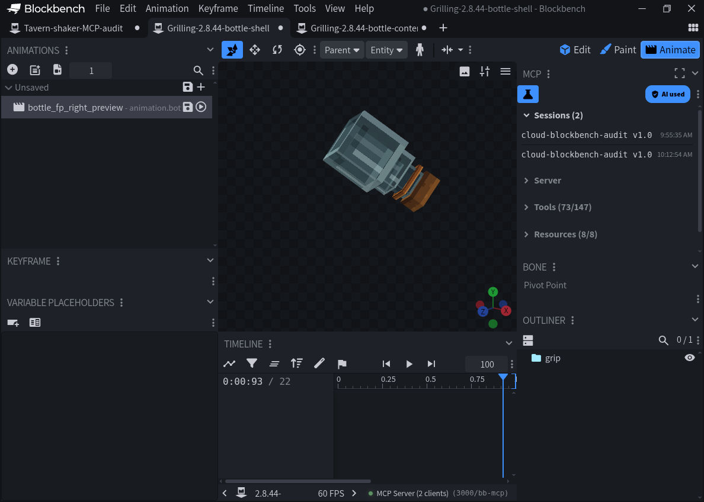
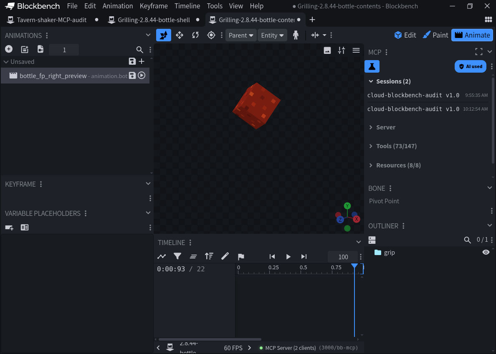

# A2.8.52 — bottle native first-person attachment frame

Base source: `b3fd0d2630870c9abf2b2b5dd1b58c34dc555f59` (published 2.8.51).

## Fixed

Seasoning bottles now use the same pinned Mojang arm/item socket basis as the repaired 2.8.43 skewers, instead of the Blockbench display-camera calibration. Only `bottle_fp_right` and `bottle_fp_left` change. Third-person, skewers, geometry, textures, materials and gameplay are unchanged. The advanced rack correctly remains a Java-generated sprite; unused historical rack poses are not reintroduced.

## Evidence

The fixed head-centered native projection passes all 266 bottle geometry/hand cases, checking shells and opaque contents separately. Replaying the previous bottle poses reproduces 132 misses (66 non-empty attachables in both hands; 42 unique contents geometries). This projection uses a fixed 16:9 envelope and is not a Minecraft rendering test.

Actual Blockbench 5.2.1 local MCP calls created two temporary models from the canonical full seasoning bottle shell and contents geometries, loaded their original texture, and created a numeric preview pose directly from the candidate's right-hand transform, with Bedrock-to-editor axis conversion. Both models were inspected in Animate mode. These screenshots show standalone editor geometry and pose, not native hand/camera rendering or material compositing.

## Checks

- `test_native_bottle_fp.py`: 4 tests, 266 attachable/geometry/hand cases; old-pose failure reproduced; only two tracks changed
- `test_held_pose_frames.py`: 4 tests, reproducible generated runtime and native projection coverage
- Complete `verify_current.py` chain through 2.8.52 passed, preserving the integration 2.8.49–2.8.51 checks; 417 relative imports checked
- Baseline/version hashes, historical identity preservation and package export checked separately

Minecraft client/FOV/VR, live installation and saved-world acceptance were not performed. Other eating-animation discrepancies remain open; this release candidate does not claim complete Java parity.

The editor captures retain the provisional 2.8.44 model-tab name. Before publication the candidate was rebased onto newly merged 2.8.45 and renumbered 2.8.46; the inspected bottle geometry, texture and two pose tracks are identical. Existing 2.8.44/2.8.45 release identities and all incoming gameplay changes are preserved.

A second integration retained the concurrently merged 2.8.46 series-label repair and assigned final candidate identity 2.8.47. The original locally proposed .44/.46 bottle identities were never released. Upstream release-history entries are unchanged.

Latest reconciliation uses main 2.8.48, retaining the independently published 2.8.47 eating-arm and 2.8.48 feedback changes. The bottle candidate is now 2.8.49. The previous unpublished draft .47 identity is not the independently published .47. The latest local immutable claim gate is run after refreshing remote-tracking branches; claims coordinate this Git common directory only, not other computers.

## 2026-10-03 canonical integration

The bottle-only draft formerly used unpublished 2.8.49. PR123 independently retained failed integration identities 2.8.49 and 2.8.50 before publishing 2.8.51. Those incoming histories, status documents and verifier modules are preserved byte-for-byte. This bottle candidate is now 2.8.52, based on merged PR123; bottle evidence and regression fixtures have distinct 2.8.52 filenames. Both bottle pose tracks, geometry and textures remain identical to the earlier Blockbench-inspected candidate. No integration API, Java-long hash, gameplay or sound/particle changes are removed. Local release claims are checked after fetching known remote heads, but are not a reservation across other clones.
