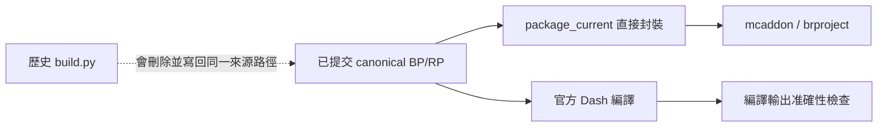

# 煙火移植 Phase 0 稽核與決策

2026-10-08。稽核基準為 canonical `main`
`6fc3ab711e90ae9f23739b18b1f28ef5f31bbf8a`，煙火 2.8.114。
遠端全名與 repository ID 已核對為
`casama233/kaleidoscope-grilling-unofficial`／`1377218440`。
本輪只完成來源、建置、測試及 PR 盤點，沒有修改玩法、刪除測試或處置舊 PR。

## 決策建議

**先重整現有 canonical runtime 與驗證入口，再做一條固定牛肉串的垂直切片；目前沒有足夠依據全面重寫。**

當前版本有可封裝的直接來源、交易與原生容器實作，也有真正 BDS 載入和保存資料的證據。
問題是歷史生成器、長驗證鏈、互相分岔的診斷 PR 與現行說明混在一起；玩家操作和 Java 聲畫對照尚未閉合。
應先利用既有有效邏輯，取得可辨別正確與錯誤的原作向量和客戶端場景，再決定哪些模組重做。

立即應處理的來源管理問題是 **舊生成器會覆蓋現行 runtime**。附件 README 的
`build_assets.py → development/gameplay_core/build.py → Dash` 不適用於現在的版本。
`build.py` 會先刪除 `projects/grilling/gameplay_core`，重建成 A2.0.0／Cookery 1.0.6。
這是程式碼確認的風險；本輪沒有執行該破壞性命令。

## 附件的主張與核實結果

| 主張 | 核實結果 | 決策 |
| --- | --- | --- |
| 目前 release 依序疊加 `build.py`、`augment_a21/a22` | 不成立。現行封裝直接讀 canonical BP/RP；該序列屬歷史重建 | 保留現行封裝，下一輪隔離危險舊入口並修正建置說明 |
| 已有 18 個 open PR、2 個 issue | API snapshot 確認；18 個 PR 均為 draft | 已逐個查差異，處置建議見 PR 表；本輪未合併或關閉 |
| 沒有真正 BDS 證據 | 不成立。現行家族有首次／重啟與最新停服存檔演練 | 保留具體 C 類證據，不把載入成功推成完整玩法驗收 |
| `client=false` 代表從未有人測過 | 不成立。有舊候選的限定真人操作記錄；完整現行聲畫驗收仍缺 | 保留版本與範圍，不能沿用成 G114 全流程 D 通過 |
| Cookery 1.6.0／1.0.6 是當前相依衝突 | 當前 baseline 與兩側 manifest 均為作者 1.6.0；1.0.6 位於歷史敘述 | 下一轮整理 README 的現行與歷史區段 |
| G75、G80 有同號不同內容 | 成立，但不同提案未被當成同一 canonical 發版；有效差異已用新身份整合 | 保留歷史來源，繼續禁止版本身份重用 |
| 應取消 hash／候選／家族准入 | hash 不可作為玩法或畫面驗收；必要來源、發版、備份、遷移與部署邊界仍有作用 | 與 A–D 功能證據分開列；本輪不取消既有部署規則 |
| 要先看程式再決定修補或重做 | 成立 | 已取得建置、測試、未合併功能與來源的決策依據 |

## 現行建置與环境

| 項目 | 核對值 |
| --- | --- |
| 包版本 | 2.8.114，唯一現行 runtime 身份在 `baseline.json` |
| canonical BP/RP | `projects/grilling/gameplay_core/behavior_pack`、`resource_pack` |
| bridge 入口 | 倉庫根 `config.json`，直接指向同一組 canonical packs |
| 最低 engine 宣告 | 1.26.50；實際現行 BDS 為 1.26.51.1 |
| Script API | `@minecraft/server` 2.9.0；`@minecraft/server-ui` 2.2.0 |
| Cookery | 作者 1.6.0；家族 Board／油壺等擴充能力須另分辨，不能推成普通原包自帶 |
| 本輪封裝環境 | Linux、Python 3.12.3、Git 2.43.0；Node 22.23.3 可用 |
| 本機 bridge Dash | 不在 PATH；`/usr/bin/dash` 是 shell，不能當成編譯器 |
| 真機驗收 | `client=false`、`production_ready=false` |

本輪從乾淨固定版本 checkout 實際執行一次
`package_current.py --output-dir artifacts/review`，成功產出現行 mcaddon 與 brproject。
這是**封裝與完整性前置檢查**；不是 A–D 功能驗收，也沒有冒充本機 Dash 編譯。
完整 Windows Dash 編譯證據來自原候選 CI，本輪未重跑功能套件。
這次用的是共享 Git objects 的乾淨 worktree，不是新做的獨立網路 clone。
詳細可重跑步驟與限制見 [BUILD.md](BUILD.md)。

另有仍具 `contents:write` 的歷史 localization workflows，含直接 commit/push 主幹的步驟。
現行舊版本 gate 會先拒絕 G114，**沒有證據說它們已覆蓋今日來源**；
但保留這些入口會增加誤操作風險。下一輪應歸檔或收窄權限與觸發條件。

## Java 來源與 A–D 證據

Java 維護分支為 Forge 1.20.1 與 NeoForge 1.21.1；目前正式參考發布均是 1.1.1，
分別為 [CF8726006](https://www.curseforge.com/minecraft/mc-mods/kaleidoscope-grilling/files/8726006)
與 [CF8726014](https://www.curseforge.com/minecraft/mc-mods/kaleidoscope-grilling/files/8726014)。
六小時唯讀監視器在 2026-10-08 04:23 UTC 核對這兩個分支，仍標示完整移植未驗證。

完整公開原始碼 checkout 可取得，選定 revision 為
[`9a1acdab27698457bec16c9362678e574895a28c`](https://github.com/breezeth-CN/KaleidoscopeGrilling/tree/9a1acdab27698457bec16c9362678e574895a28c)。
現有 asset snapshots 只涵蓋選定資料，不能稱完整 Java source 或已執行完整 release JAR。
原碼保留 BSD-3-Clause；素材保留 CC BY-NC-SA 4.0，Minecraft 模板仍需分別標示來源。

| 證據類別 | 本輪可確認 | 邊界 |
| --- | --- | --- |
| A：執行原 Java 純邏輯 | 已核對原 `FoodState` 的常數與 `bucket` 方法，重新編譯／執行既有 Java oracle，輸出與 heat fixture 相符 | 只涵蓋非負時間的 100-tick 熱度桶；沒有測 G114 runtime、完整 JAR 或全牛肉串流程。repo 尚缺可重跑的 generator |
| B：不變量 | 有實際 production 模組的交易回滾、物品／油量守恆、重複結算拒絕等 source 測試 | 使用 API doubles 的部分不能認證原生事件；本輪未重跑 B 或新增變異測試 |
| C：真 BDS | 現行完整家族首次／重啟與最新停服存檔首次／重啟已有證據；18 筆玩家資料與既有自訂容器內容保留 | 當時 0 玩家；保存玩家資料不等於真人操作。舊 G29 核心流程不能改名成 G114／Cookery 1.6.0 全流程 |
| D：真客戶端 | 有舊候選局部進食／掛架／餐盤觀察與失敗記錄 | 沒有当前同一候選的完整 Java↔Bedrock 牛肉串聲畫矩陣；不能據此標完整 D 通過 |

static、compile、引用鏈、hash 和來源身份檢查獨立列為前置，不計入 A–D。
[TEST-AUDIT.md](TEST-AUDIT.md) 與 [逐檔清單](TEST-INVENTORY.json) 記錄具体用途、重複呼叫和未明項。
有些檔案只完成初分，已明列「待人工複核」，不以檔名或斷言數認證其有效性。

現行家族的引擎副本保留了原存檔既有實驗旗標，包括 GameTest、upcoming_creator_features 等。
**這不是本輪開啟，也不是執行過 GameTest 的證據；現有載入證據未證明關閉全部實驗仍可完整運作。**
官方 [GameTest module](https://learn.microsoft.com/en-us/minecraft/creator/scriptapi/minecraft/server-gametest/minecraft-server-gametest?view=minecraft-bedrock-experimental)
目前仍列 prerelease；[入門要求](https://learn.microsoft.com/en-us/minecraft/creator/documents/gametestgettingstarted?view=minecraft-bedrock-stable)
與穩定 Script API 要分開。用戶禁止模擬玩家，後续 C 場景也須遵守。
官方 [server module](https://learn.microsoft.com/en-us/minecraft/creator/scriptapi/minecraft/server/minecraft-server?view=minecraft-bedrock-stable)
文件列出更高版本，並不代表選定 BDS 可以直接升級；本輪沒有升 API 或改實驗設定。

## PR、版本分岔與具體缺口

逐個處置建議見 [PR-TRIAGE.md](PR-TRIAGE.md)。

- #119、#142、#172、#174 的列明有效修補已由現行來源承接；建議記錄承接處後關閉舊草稿。
- #145 是未入主幹的有限 G81 真人觀察文件，可獨立審查。
- #146、#148、#149、#150、#152、#153 含現行 main 尚缺的餐盤修補或功能，不能誤稱已合併。
  應從 current main 重提窄 PR，避免帶入整套過時 union。
- #147、#155、#156、#158、#161、#163、#164 以舊餐盤診斷為主。
  將有效失敗、控制組與修補候選保存到 [BUGS.md](../BUGS.md) 後，再決定關閉。
  #164 的 count 修補尚未得到其候選原生驗收，且對應子系統尚未在 main。

| 分岔 | 原提案 | 現行保留決策 |
| --- | --- | --- |
| 兩份 G75 | PR139 `aada09a9…`、PR140 `9c33d3f5…`；其中一份曾有不合法單一 32-value block state | 有效差異已用 G78 一致來源整合；保留原提案作歷史，不能把兩份樹當同一身份 |
| 兩份 G80 | checkpoint-stop PR143 `b6f938a4…`、jar projection PR142 `9c1ac4a5…` | 已用新 G81 身份整合，現行 G114保留；不合併舊 manifest 或沿用另一份收據 |

來源：[G78 整合記錄](../STATUS-A2.8.78.md)、[G81 整合記錄](../STATUS-A2.8.81.md)。
`G` 是歷史敘述標籤；當前 `[2,8,114]` 本身已是三段版本。
不能只移除字母 G 就解決內容分岔；必須保持單一來源、版本不可重用及 PR 範圍清楚。
另有未提交的調料註冊原型，尚未發版或驗證完成，沒有當作現行功能，本輪保留其工作區。

## 下一階段的選擇

建議採取**先重整入口與驗證，再限定一條 fixed beef 切片**的路線：

1. 移除現行 README 對破壞性歷史重建的推薦，隔離舊 generator 的輸出；整理有寫權舊 workflows。
2. 將來源／封裝／部署完整性前置與 A–D 功能驗證分組；消除同一 current chain 內的重複呼叫，保留高價值守恆／回滾 B。
3. 把可執行原作向量 producer 納入 Git；補固定牛肉串核心狀態與交易契約的真值，不能以抄同一公式當期望。
4. 在同一候選上完成取材→穿製→刷油→四翻→撒料→取出→吃→保存的一條流程。
   固定牛肉串 Java 配方是牛肉塊／紅辣椒／牛肉塊；熟串 nutrition 5、saturation modifier 0.6、Strength 10 秒、FOUR profile 90 ticks。
   25-tick 提前結算與完整動畫時間要分開。
5. C 僅补原生容器／跨包／保存／事件的缺口；D 由使用者在真客戶端與 Java 對照。
   在完成切片前，不擴張其餘功能，也不以全面重寫跳過已知失敗。

固定牛肉串的靜態 icon 與任意食材秘製串的動態 icon 是不同問題；後者仍是已記錄缺口，
不應因前者通過就被宣稱完成，也不應未說明就拿後者阻止固定牛肉串切片。
餐盤營養邊界、防誤食和顯示屬其他明確工作，列入 BUGS，先由維護者選擇優先序。

## 本輪交付與未驗證項

- 已核對：遠端身份／main、現行相依與 engine、實際封裝入口、一次乾淨封裝、原 Java 熱度桶 oracle可重跑、18個 PR 的差異和測試呼叫圖。
- 未驗證：新 Java release JAR 全執行、G114完整玩家流程／雙人競態／卸載場景、所有相機與雙手聲畫、關閉全部實驗的完整家族、效能预算、一般變異測試。
- 本輪沒有刪除測試、修改 runtime、合併／關閉舊 PR，或更新 LIVE。
- 本輪沒有將平台能力缺口直接決定為永久放棄；下一階段需要有來源、實際場景與維護者決策。

本報告是 Phase 0 的決策依據，不是完成移植或全面還原的聲明。
