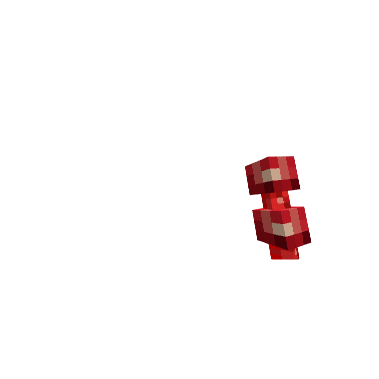
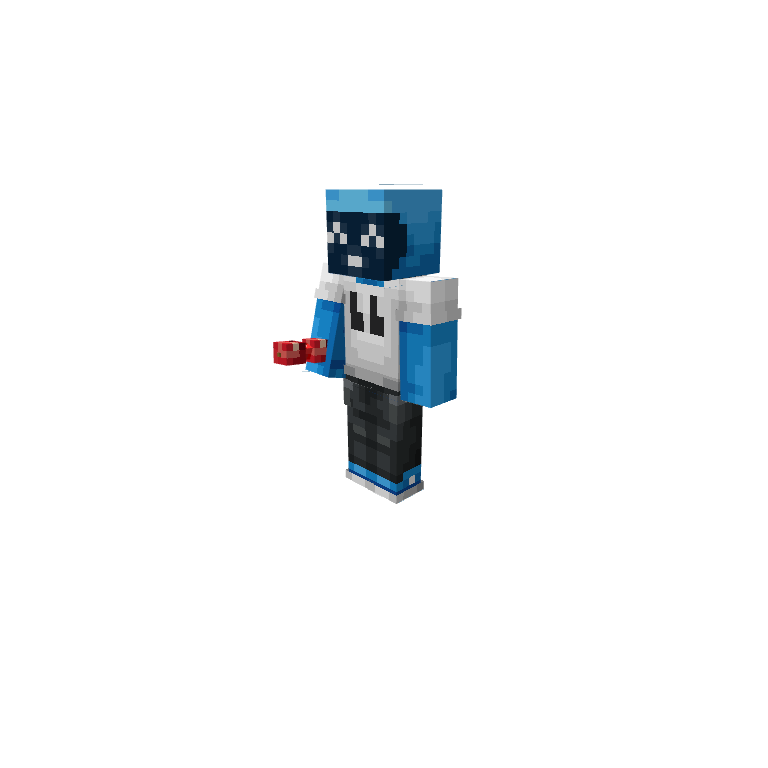
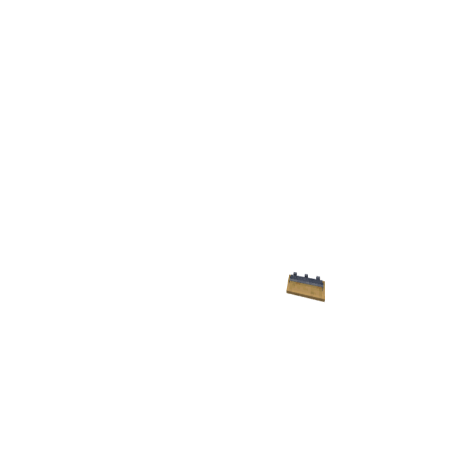
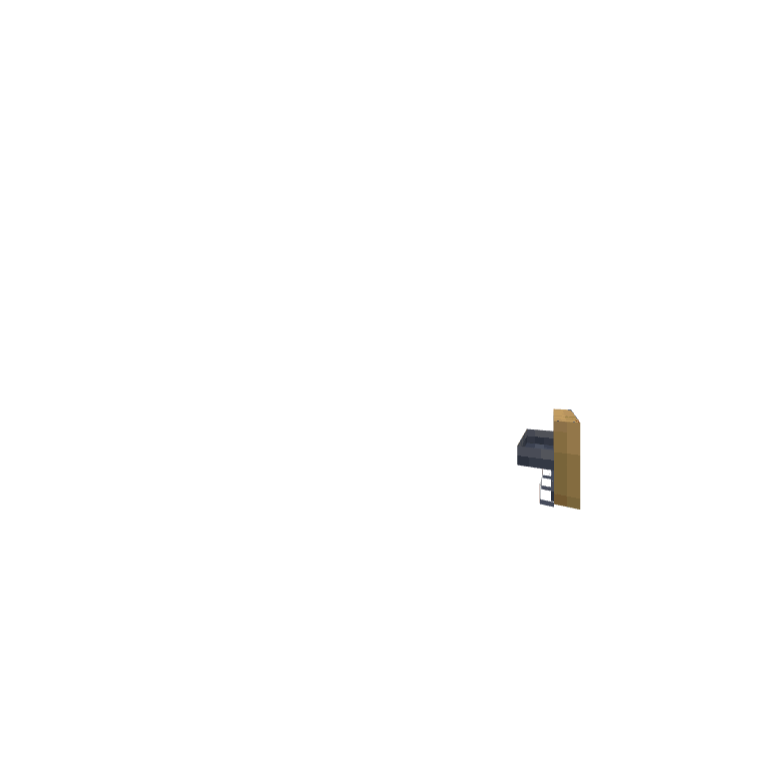
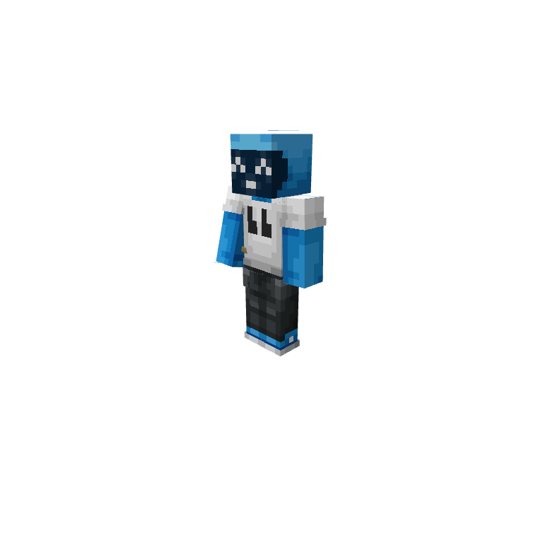
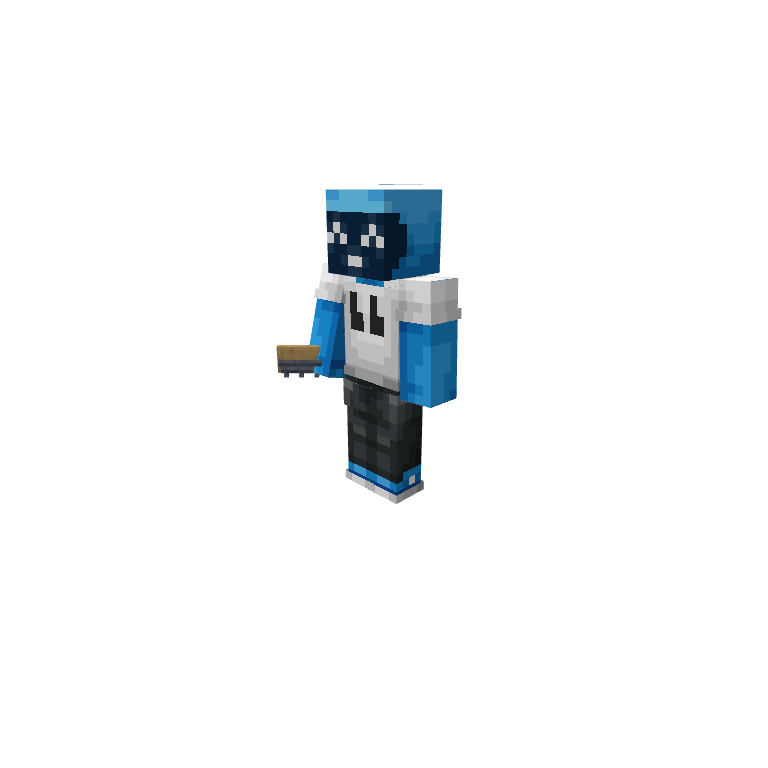
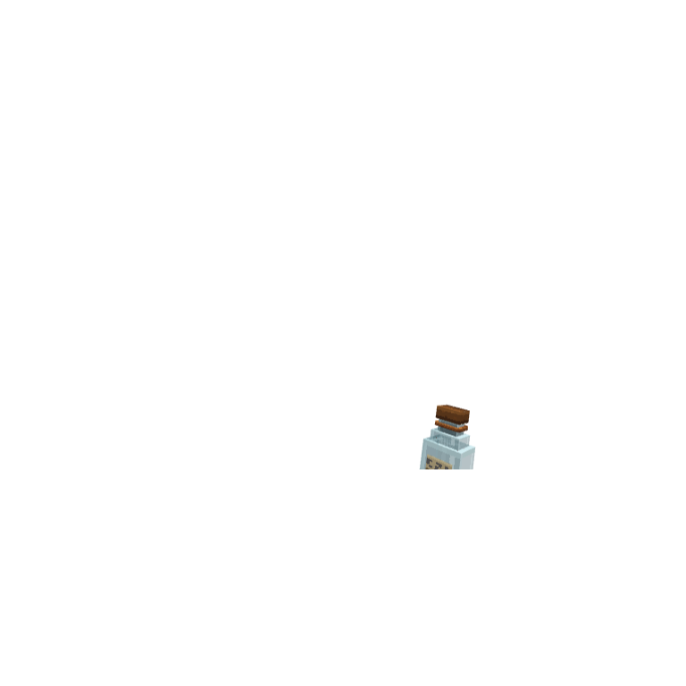
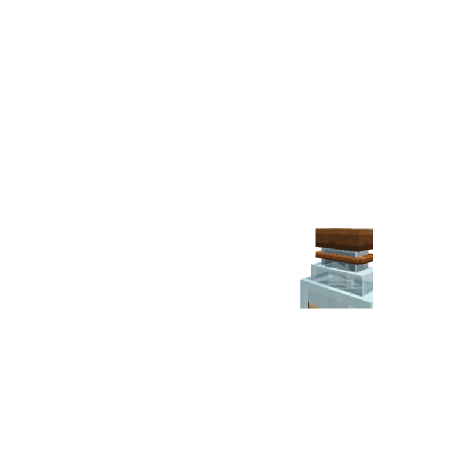
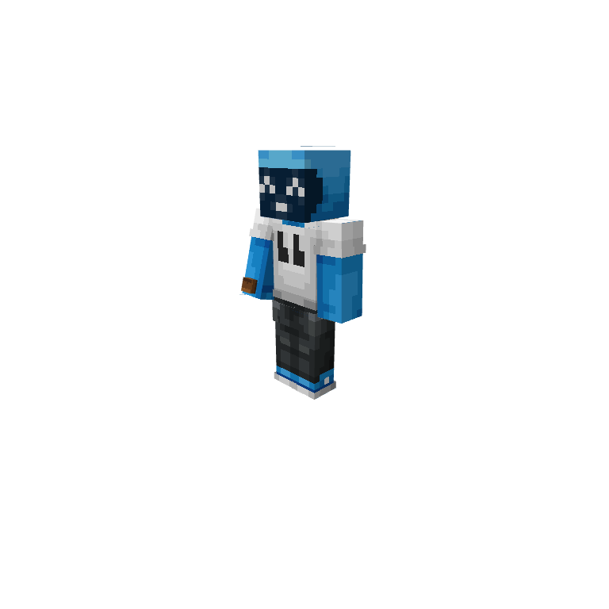
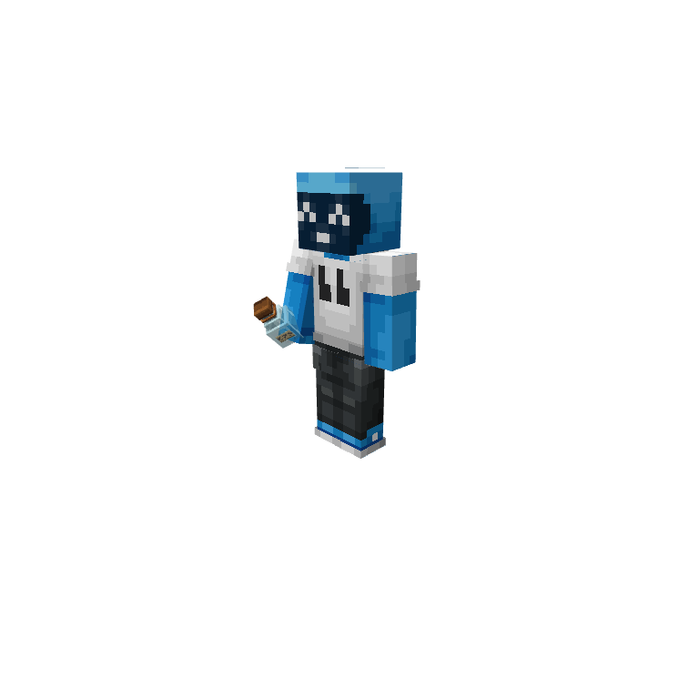

# Native model and held-display audit — 2026-10-01

The skewer first-person editor calibration below is superseded by the
[2.8.43 player-bone candidate repair](../../STATUS-A2.8.43.md) following a
real client failure. These historical editor captures never certified
Minecraft first-person visibility.

## Source and tool

- Inspected canonical baseline: `6fe8864f323603ee1c833000045543e9105ed685` (2.8.17)
- Official Blockbench 5.2.1 Linux, package SHA-256:
  `d6329fd8db35a6e1ffb86c3f61b77ff193c6526418e6454e1cac863a0e384003`
- Java reference: `kaleidoscope_grilling-1.1.1-neoforge1.21.1.jar`, SHA-256:
  `cf31071e4ba790bcd5c1d3f6005439bc512acba084e70b8ab6a767e8c8f99dd6`
- Actual native editor execution, not a stand-alone parser impersonating it

## Structural result

922 definitions in 859 geometry files were individually loaded, validated and
compiled by the native Bedrock codec: zero parse/Validator/nonfinite-mesh errors
or warnings. Source hashes stayed unchanged. See `native-model-audit.json`.

Round-trip review aligned bones by name (the editor reordered four models).
Other differences were 712 sub-1e-9 float changes, 61 omitted empty cube arrays,
42 added display defaults, and 25 recomputed culling-bound fields. No unexplained
geometry/UV/material differences remained. Exports were **not** written back.

This does not prove every texture/material combination looks correct in-game.

## Visual failure and repair

The native editor's attachment view exposed an actual failure despite passing
anchor tests: skewer third-person direction went upward inside the reference arm;
first-person was outside the view. Java's native display reference showed a
forward-pointing held skewer. The old implementation copied XYZ Java display
angles into ZYX Bedrock bone animation without converting the item reference frame.

The repair derives matrices from the editor's Java/Bedrock frames, converts the
Euler convention, and compensates each mesh's source origin. It retains all
geometry, UVs, textures, native eating and existing skewer handle anchoring.
Bottle and rack placements are also converted. Rack first-person placement is
explicitly adjusted into the visible Bedrock hand region; its absent Java FP-left
slot receives a documented mirrored fallback rather than an invented parity claim.

| Before | Repaired |
|---|---|
|  |  |
|  |  |
|  |  |
|  |  |
|  |  |
|  |  |

## Honest boundaries

- 107 attachables share three pose families; every view/slot selector and every
  referenced geometry is checked, including all 150 skewer bite geometries
- All 107 configurations were loaded into native right-hand first-/third-person preview (214 captures); every first-person image had nonzero model pixels. This is recorded separately from
  offhand mathematical/selector verification
- Bottle contents are merged for editor inspection only; game's multipass alpha
  sorting and runtime render controllers are not reproduced by that preview
- Native eating arm motion is retained, but eating-to-mouth alignment, actual
  client FOV/skin/mobile behavior, live resource-pack state and saved-world
  migration are **not** accepted by these checks
- The earlier “first-person unchanged” assertion preserved bad input. It has been
  replaced by conversion and viewport checks, not used as proof of visual quality

Official reference: [Microsoft attachment/binding and Blockbench workflow](https://learn.microsoft.com/en-us/minecraft/creator/documents/attachables?view=minecraft-bedrock-stable).
